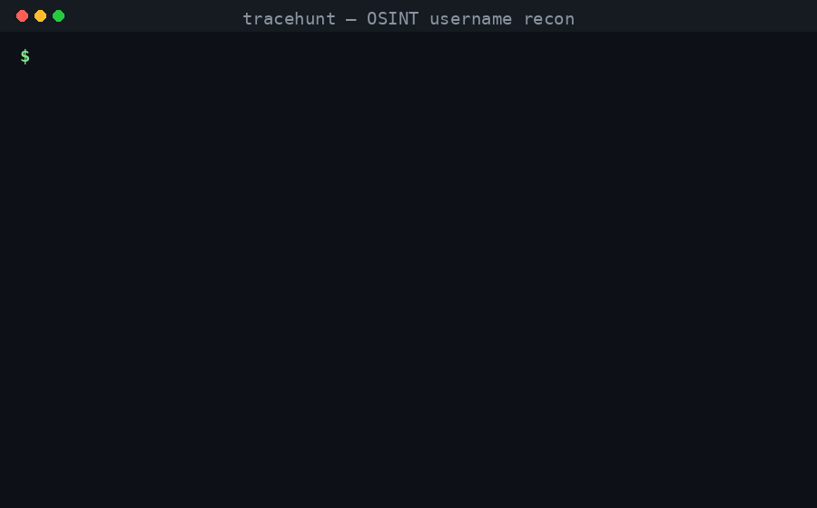
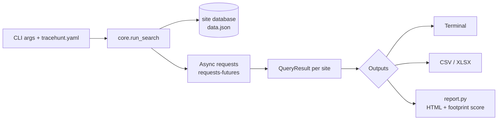

<h1 align="center">🔎 TraceHunt</h1>

<p align="center">
  <b>Find any username across 480+ platforms in seconds.</b><br>
  OSINT recon with one-file HTML reports, a 0–100 digital-footprint score, and a privacy-first <i>no-phone-home</i> default.
</p>

<p align="center">
  <a href="https://github.com/Hayatelin/tracehunt/releases"></a>
  
  
  
  <a href="https://github.com/Hayatelin/tracehunt/stargazers"></a>
</p>

<p align="center"></p>

<p align="center"><i>One command, a ranked list of every platform a username exists on, plus a shareable HTML report.</i></p>

---

TraceHunt is a privacy-respecting, self-hostable fork of the well-known
[Sherlock](https://github.com/sherlock-project/sherlock) project (MIT). It keeps
Sherlock's battle-tested detection engine and site database, and adds reporting,
scoring, configuration and a *no-phone-home* default. See
[`NOTICE.md`](NOTICE.md) for full attribution and the list of changes.

> **For authorized security research and OSINT only.** Check the laws in your
> jurisdiction and only investigate accounts you are permitted to.

---

## 繁體中文摘要

TraceHunt 是一套 **OSINT 使用者名稱偵查工具**：輸入一個帳號名稱，它會在 480+ 個
社群/平台上查詢該名稱是否被註冊，協助資安研究與數位足跡盤點。

本專案是知名開源工具 **Sherlock** 的客製化分支（MIT 授權），在保留原本偵測引擎與
網站資料庫的基礎上，**新增**了以下功能：

- **HTML 報告**：一鍵產生美觀、可離線開啟的單檔報告（`--html report.html`）。
- **數位足跡評分**：統計命中數並換算 0–100 分的足跡分數（`--summary`）。
- **YAML 設定檔**：把常用參數寫進 `tracehunt.yaml`，免得每次重打（`--config`）。
- **隱私優先**：原版啟動時會自動連線檢查更新，本版改為 **預設不連外**，只有加上
  `--check-update` 才會檢查。

授權與致謝請見 `NOTICE.md`；原始著作權保留於 `LICENSE`。

---

## Features

| | |
|---|---|
| 480+ sites | Hunt a username across hundreds of platforms in parallel |
| HTML report | `--html report.html` -> a self-contained, styled report you can share |
| Footprint score | `--summary` -> counts + a 0–100 "digital footprint" score |
| Config file | `--config tracehunt.yaml` -> store your default flags |
| No phone-home | Update check is **opt-in** (`--check-update`), unlike upstream |
| Exports | CSV (`--csv`) and Excel (`--xlsx`) like Sherlock |

## Install

```bash
git clone https://github.com/Hayatelin/tracehunt.git
cd tracehunt
pip install -r requirements.txt
# optional: install as a CLI command
pip install .
```

Requires Python 3.9+.

## Quickstart

```bash
# Basic: hunt one username, print results to the terminal
python -m tracehunt johndoe

# Generate a styled HTML report + a footprint summary
python -m tracehunt johndoe --html johndoe.html --summary

# Limit to specific sites and export CSV
python -m tracehunt johndoe --site GitHub --site Reddit --csv

# Use a config file for your default options
python -m tracehunt johndoe --config tracehunt.yaml
```

If you installed it as a command, replace `python -m tracehunt` with `tracehunt`.

## 🤖 Use it from your AI agent (MCP + skill)

TraceHunt ships with an **MCP server** and an **Agent Skill**, so Claude Code,
Cursor, Codex or Gemini CLI can run username recon for you on demand.

```bash
pip install "mcp[cli]" -r requirements.txt
python mcp/tracehunt_mcp.py        # exposes hunt_username() + footprint_score()
```

Register it with your agent (see [`mcp/README.md`](mcp/README.md)), then just ask:
*"use tracehunt to check the username octocat"*. Prefer the no-MCP route? The
[`skill/SKILL.md`](skill/SKILL.md) teaches an agent to drive the CLI directly.
There's also a plain Python API: `from tracehunt.api import hunt`.

## Architecture



## What's different from Sherlock

The detection engine and site list come from Sherlock (MIT). The added value:

- `tracehunt/report.py` — HTML report + footprint scoring (new, stdlib only)
- `tracehunt/config.py` — YAML config loader (new)
- `core.py` — new `--html / --summary / --config / --check-update` flags; the
  automatic update check is now opt-in, and the bundled offline DB is the default.

Full details and attribution: [`NOTICE.md`](NOTICE.md).

## Tests

```bash
pip install pytest PyYAML
pytest
```

## License

MIT — see [`LICENSE`](LICENSE). Original work © 2019 Sherlock Project;
TraceHunt modifications © 2026 VictorLin.
